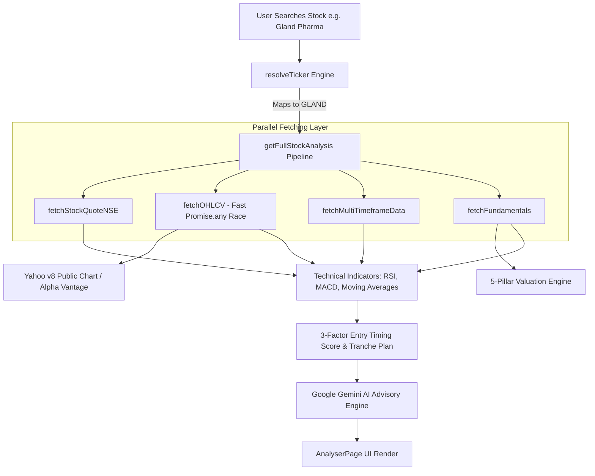

# System Execution Flow & Code Architecture — StockSense AI

This document provides a technical walkthrough of the application's entry points, component hierarchy, function call order, data pipeline flow, and session modifications.

---

## 1. Application Entry Point & Initialization Sequence

```
index.html ──► src/main.jsx ──► src/App.jsx (Main Layout, Header, State Management)
```

1. **`index.html`**: Root HTML template containing Google Font imports (Poppins, Inter, JetBrains Mono) and root DOM element `<div id="root"></div>`.
2. **`src/main.jsx`**: React 18 root mount point rendering `<App />` inside React StrictMode.
3. **`src/App.jsx`**: Main state controller managing:
   - Active Tab State (`activeTab`: `'home'`, `'analyser'`, `'compare'`, `'learn'`).
   - Selected Stock Symbol (`selectedSymbol`).
   - Gemini API Key state (`geminiApiKey` stored in localStorage).
   - API Settings Modal open/close state (`isKeyModalOpen`).

---

## 2. Page Components & Architecture Breakdown

```
src/App.jsx
 ├── Header.jsx (Navbar, Tab Switches, Gemini Key Modal Trigger)
 ├── GeminiKeyModal.jsx (Dual API Key Settings Modal)
 ├── HomePage.jsx (Live Benchmark Indices, Market Mood Gauge, Top Gainers/Losers)
 ├── AnalyserPage.jsx (Fundamental Stock Analyser Dashboard)
 ├── ComparePage.jsx (Side-by-Side Dual Stock Comparison)
 └── LearnPage.jsx (10 Technical Chart Patterns Educational Guide)
```

---

## 3. Function Call Order & Execution Hierarchy

When a user searches or selects a stock (e.g. *"Gland Pharma Limited"* or `"RELIANCE"`):

```
1. User Input in StockSearchInput.jsx
   └──► handleSubmit() / handleSelect()
         └──► resolveTicker(input) -> Returns exact ticker (e.g. "GLAND")
               └──► Triggers setSymbol("GLAND") in AnalyserPage.jsx

2. AnalyserPage.jsx
   └──► runAnalysis("GLAND")
         └──► getFullStockAnalysis("GLAND", geminiApiKey, alphaKey) [stockDataService.js]

3. getFullStockAnalysis() Pipeline [stockDataService.js]:
   ├──► resolveTicker("GLAND")
   ├──► Promise.all([
   │      fetchStockQuoteNSE("GLAND")           [nseService.js]
   │      fetchOHLCV("GLAND", alphaKey)         [stockSearchService.js]
   │        └──► fetchWithProxy() -> Promise.any([Direct, Corsproxy, Allorigins])
   │        └──► parseChartData() -> Converts timestamps to daily OHLCV
   │      fetchMultiTimeframeData("GLAND")      [multiTimeframeService.js]
   │        └──► In-memory aggregation for 1W & 1H candles
   │      fetchFundamentals("GLAND", alphaKey)  [fundamentalService.js]
   │        └──► Calculates 5-Pillar Scores (Valuation, Growth, Health, Profitability, Dividend)
   │   ])
   ├──► calculateRSI(closes, 14)                [technicalIndicators.js]
   ├──► calculateMACD(closes)                   [technicalIndicators.js]
   ├──► detectPatterns(candles)                 [technicalIndicators.js]
   ├──► calculateConfidenceScore()              [technicalIndicators.js]
   ├──► calculateEntryPoint(entryData, rsi, macd) [entryScoring.js]
   ├──► calculateSignal(technicalParams)        [signals.js]
   └──► analyzeFundamentalWithGemini()          [geminiService.js] -> Returns Hinglish AI Advisory

4. UI Component Rendering [AnalyserPage.jsx]:
   ├──► Stock Banner Header (Symbol, Sector, Live Price, % Change)
   ├──► FundamentalDashboard.jsx (5 Pillars Radar & Detailed Metrics)
   ├──► Gemini AI Advisory Card
   └──► TechnicalEntrySection.jsx (TradingView Lightweight Candlestick Chart + Tranche Plan)
```

---

## 4. End-to-End Data Pipeline Diagram



---

## 5. Summary of Code Changes Made in This Session

Below is a detailed inventory of files modified and created in this session:

### 🆕 Files Created:
1. `src/services/nseService.js`: NSE Direct API & BSE Open API service for benchmark indices, market movers, and quotes.
2. `src/services/alphaVantageService.js`: Alpha Vantage fetchers for daily chart time series and company overview.
3. `.npmrc`: Configured `legacy-peer-deps=true` for Vercel build compatibility.
4. `decisions.md`: Architectural decision log.
5. `flow.md`: System execution flow and code architecture documentation.

### ✏️ Files Modified:
1. `src/services/stockSearchService.js`:
   - Replaced Yahoo Finance dependency with fast parallel proxy racing (`Promise.any`).
   - Added `parseChartData` for Yahoo v8 chart JSON.
   - Added `resolveTicker()` for automated company-to-ticker mapping (e.g. *"Gland Pharma Limited"* -> `"GLAND"`).
2. `src/services/stockDataService.js`:
   - Updated unified pipeline to use NSE + Alpha Vantage + Yahoo v8.
   - Integrated `resolveTicker` so search inputs are normalized before fetching.
3. `src/services/fundamentalService.js`:
   - Removed Yahoo Finance `quoteSummary` calls.
   - Integrated 5-Pillar fundamental rating calculations.
4. `src/services/multiTimeframeService.js`:
   - Removed 3 separate network calls; now aggregates 1W and 1H candles in memory from daily OHLCV data.
5. `src/pages/HomePage.jsx`:
   - Connected NIFTY 50 and SENSEX to live NSE/BSE Direct APIs.
   - Implemented **100% dynamic Market Mood Index formula** calculated from live index momentum and market breadth.
6. `src/pages/AnalyserPage.jsx`:
   - Updated layout for long-term fundamental analysis dashboard.
   - Integrated rate limit warning notice for Alpha Vantage.
7. `src/pages/ComparePage.jsx`:
   - Integrated dual stock search and side-by-side 5-Pillar & 3-Factor comparison.
8. `src/components/StockSearchInput.jsx`:
   - Connected live search to `resolveTicker` and updated searching indicator to reference NSE Direct API.
9. `src/components/GeminiKeyModal.jsx`:
   - Expanded into a **Dual API Settings Modal** for both Google Gemini and Alpha Vantage keys with live status indicators.
10. `src/components/StockChart.jsx` & `FundamentalDashboard.jsx`:
    - Updated footer attribution labels to "Source: NSE Direct API & Alpha Vantage".
11. `package.json` & `vercel.json`:
    - Purged unused `@react-spring/three` package to fix npm `ERESOLVE` build errors on Vercel.
    - Added `"installCommand": "npm install --legacy-peer-deps"`.
